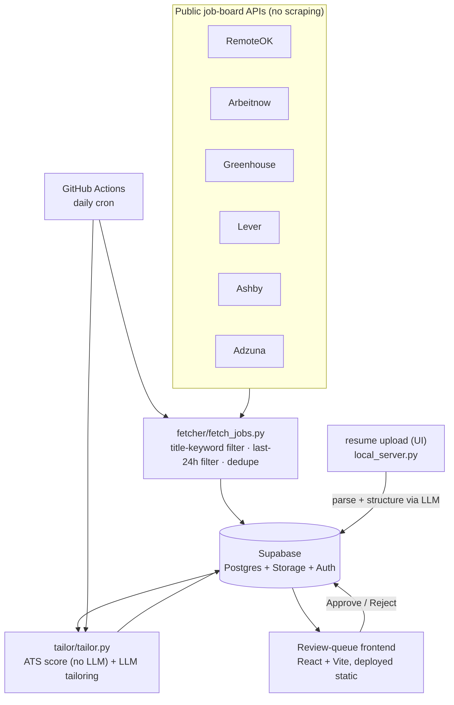

# Job Search Agent

A daily-refreshed queue of new ML / AI / Data Engineer job postings, each with
an LLM-tailored resume + cover letter and a deterministic ATS keyword match
score, waiting for **you** to review and approve. Nothing is ever submitted
to an employer automatically.

Runs entirely on free tiers — no paid hosting, no scraping of ToS-restricted
sites, no blind auto-apply.

---

## Table of contents

- [Overview](#overview)
- [How it works](#how-it-works)
- [Tech stack](#tech-stack)
- [Project structure](#project-structure)
- [Getting started](#getting-started)
- [Running it locally](#running-it-locally)
- [Going live: daily automation](#going-live-daily-automation)
- [Configuration reference](#configuration-reference)
- [Extending it](#extending-it)
- [Design principles](#design-principles)

---

## Overview

Job hunting means checking a dozen job boards daily, then hand-tailoring a
resume for every posting that looks relevant. This automates the tedious
half of that:

- **Fetches** new postings from public, ToS-compliant job APIs every day
- **Filters** to just the roles you care about (title-matched keywords)
- **Scores** each posting against your resume for ATS keyword overlap
- **Tailors** a resume + cover letter per posting with an LLM — grounded
  only in your real experience, no fabricated skills
- **Queues** everything in a review UI, sorted by match score, for you to
  approve or reject — you still click "apply" yourself

## How it works



1. **`fetcher/fetch_jobs.py`** pulls postings from every source, keeps only
   ones whose **title** matches your target keywords (see
   [`JOB_KEYWORDS`](#configuration-reference)) and were first seen in the
   last 24h, dedupes, and stores them in Supabase.
2. **`tailor/tailor.py`** takes your base resume, scores each new job's ATS
   keyword overlap (`tailor/ats_score.py` — deterministic, no LLM call
   needed), and asks an LLM to rewrite resume bullets and write a cover
   letter grounded only in your real experience.
3. **The frontend** (`frontend/`) shows everything in a review queue sorted
   by match score. Upload your resume there too — parsing runs through a
   small local server since it needs your LLM API key, which never ships to
   the browser. You read the tailored materials and either **Approve**
   ("ready — I'll submit this myself") or **Reject**.
4. **GitHub Actions** runs the fetch + tailor steps daily on a cron
   schedule, so new matches are waiting for you without lifting a finger.

## Tech stack

| Layer | Choice | Why |
|---|---|---|
| Job sources | RemoteOK, Arbeitnow, Greenhouse, Lever, Ashby, Adzuna APIs | Free, public, no scraping |
| Backend scripts | Python | `fetcher/`, `tailor/`, `storage/` |
| LLM | Gemini API (free tier) | Resume structuring + tailoring |
| Database & storage | Supabase (Postgres + Storage + Auth) | Free tier, RLS for auth |
| Scheduler | GitHub Actions (cron) | Free, no server to keep alive |
| Frontend | React + Vite | Review-queue UI |
| Frontend hosting | Vercel / Netlify (free tier) | Static deploy |
| Local dev fallback | SQLite | Works before Supabase is set up |

## Project structure

```
job-search-agent/
├── fetcher/
│   ├── fetch_jobs.py        # orchestrator: fetch → filter → dedupe → store
│   ├── company_list.py      # curated Greenhouse/Lever/Ashby company slugs
│   └── sources/             # one module per job source
├── tailor/
│   ├── resume_parser.py     # PDF/DOCX → structured JSON (via LLM)
│   ├── tailor.py            # per-job tailoring + PDF rendering
│   ├── ats_score.py         # deterministic keyword match scoring
│   └── llm.py                # Gemini API wrapper
├── storage/
│   ├── db.py                 # picks Supabase or local SQLite backend
│   ├── supabase_backend.py
│   └── local_sqlite.py
├── scripts/
│   └── local_server.py      # local API: resume upload + dev-mode frontend shim
├── frontend/                # React + Vite review-queue UI
├── supabase/
│   └── schema.sql            # tables, indexes, Row Level Security policies
├── .github/workflows/
│   └── daily-job-fetch.yml  # daily cron: fetch + tailor
├── .env.example
└── requirements.txt
```

## Getting started

### 1. Create accounts (all free)

| Service | Purpose | Link |
|---|---|---|
| Supabase | Database, file storage, auth | [supabase.com](https://supabase.com) |
| Google AI Studio | Gemini API key for tailoring | [aistudio.google.com/apikey](https://aistudio.google.com/apikey) |
| Adzuna *(optional)* | Broader job-search coverage | [developer.adzuna.com](https://developer.adzuna.com) |

### 2. Set up Supabase

1. Create a project, then run [`supabase/schema.sql`](supabase/schema.sql) in
   the SQL editor — creates the `jobs`, `resumes`, and `tailored_applications`
   tables plus Row Level Security policies.
2. Settings → API Keys → copy the **project URL**, the **`service_role`**
   key (for the backend scripts), and the **`anon`** key (for the frontend).
3. Authentication → Users → add yourself as the one login for the review
   queue (this is a single-user tool).

### 3. Configure environment

```bash
cp .env.example .env
```

Fill in `SUPABASE_URL`, `SUPABASE_SERVICE_KEY`, and `GEMINI_API_KEY`. See the
[configuration reference](#configuration-reference) for every variable.

Leaving `SUPABASE_URL` / `SUPABASE_SERVICE_KEY` blank makes everything run
against a local SQLite file (`storage/data/local.db`) instead — useful for
trying the pipeline before setting up Supabase.

### 4. Install dependencies

```bash
python3 -m venv .venv && source .venv/bin/activate
pip install -r requirements.txt
```

## Running it locally

```bash
# 1. Pull today's postings
python -m fetcher.fetch_jobs

# 2. Tailor + score every new posting against your resume
python -m tailor.tailor

# 3. Local server — needed for resume upload (holds your LLM key) and for
#    the frontend if Supabase isn't configured yet. Keep it running.
python -m scripts.local_server

# 4. Frontend, in another terminal
cd frontend && npm install
echo "VITE_SUPABASE_URL=...\nVITE_SUPABASE_ANON_KEY=..." > .env   # if using Supabase
npm run dev
```

Open the frontend, upload your resume from the **Resume** tab (drag & drop a
PDF/DOCX), then check the **Applications** queue. CLI alternative to upload:
`python -m tailor.resume_parser path/to/resume.pdf`.

## Going live: daily automation

1. Push this repo to GitHub (already done if you're reading this there).
2. Settings → Secrets and variables → Actions → add secrets:
   `SUPABASE_URL`, `SUPABASE_SERVICE_KEY`, `GEMINI_API_KEY`, and optionally
   `ADZUNA_APP_ID` / `ADZUNA_APP_KEY`.
3. Optionally add repo **variables** `ADZUNA_COUNTRY` / `JOB_KEYWORDS` to
   override the defaults.
4. The workflow in [`.github/workflows/daily-job-fetch.yml`](.github/workflows/daily-job-fetch.yml)
   runs on a daily cron and can also be triggered manually from the Actions
   tab ("Daily job fetch + tailor" → **Run workflow**).
5. Deploy `frontend/` to Vercel or Netlify (free tier), with
   `VITE_SUPABASE_URL` / `VITE_SUPABASE_ANON_KEY` set as its environment
   variables.

## Configuration reference

All variables live in `.env` locally, or as GitHub Actions secrets/variables
in production.

| Variable | Required | Description |
|---|---|---|
| `SUPABASE_URL` | for production | Your Supabase project URL |
| `SUPABASE_SERVICE_KEY` | for production | `service_role` key — bypasses RLS, backend-only |
| `GEMINI_API_KEY` | yes | Free-tier key from Google AI Studio |
| `GEMINI_MODEL` | no | Defaults to `gemma-4-26b-a4b-it`; override if your account has full Gemini-tier quota |
| `ADZUNA_APP_ID` / `ADZUNA_APP_KEY` | no | Enables the Adzuna source; skipped if unset |
| `ADZUNA_COUNTRY` | no | Adzuna country code, default `us` |
| `JOB_KEYWORDS` | no | Comma-separated title-match keywords, has sensible ML/AI/DE defaults |
| `VITE_SUPABASE_URL` / `VITE_SUPABASE_ANON_KEY` | for production frontend | Set in `frontend/.env`, safe to expose client-side (RLS enforces access) |

## Extending it

- **More companies**: add Greenhouse/Lever/Ashby slugs to
  [`fetcher/company_list.py`](fetcher/company_list.py). Invalid slugs are
  skipped automatically, so it's safe to try candidates.
- **Different target roles**: edit `JOB_KEYWORDS` — a comma-separated list
  matched against job titles.
- **Better ATS matching**: extend `SKILL_TAXONOMY` in
  [`tailor/ats_score.py`](tailor/ats_score.py).
- **Semi-automated applying**: a natural next step would be assisting with
  the standardized Greenhouse/Lever apply-form fields, still gated behind a
  per-application click — not built here on purpose (see below).

## Design principles

- **No scraping.** LinkedIn, Indeed, and Glassdoor prohibit it in their
  Terms of Service and actively block it. Every source here is a public or
  free-signup API.
- **No blind auto-submission.** "Approve" prepares tailored materials for
  *you* to submit — most ATS apply forms need manual file upload and
  interaction anyway, and this sidesteps CAPTCHA/ToS problems entirely.
- **No fabricated experience.** The tailoring prompt is explicit: only
  reorder/rephrase what's actually in your resume, never invent employers,
  dates, or skills.
- **$0 to run.** Every piece — compute, database, storage, hosting, LLM
  calls — fits inside a free tier at this scale.
